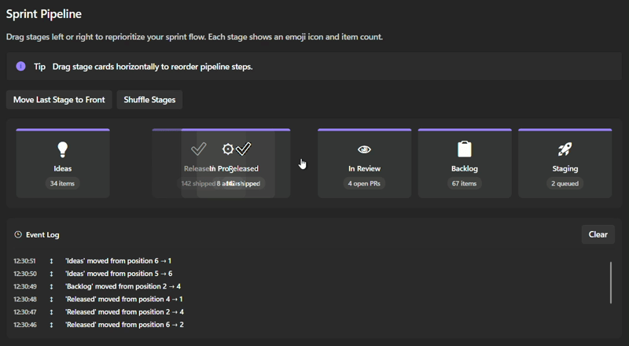
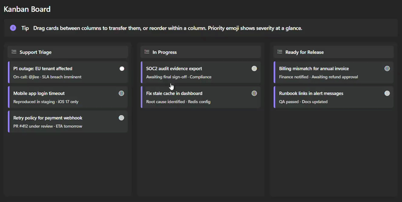
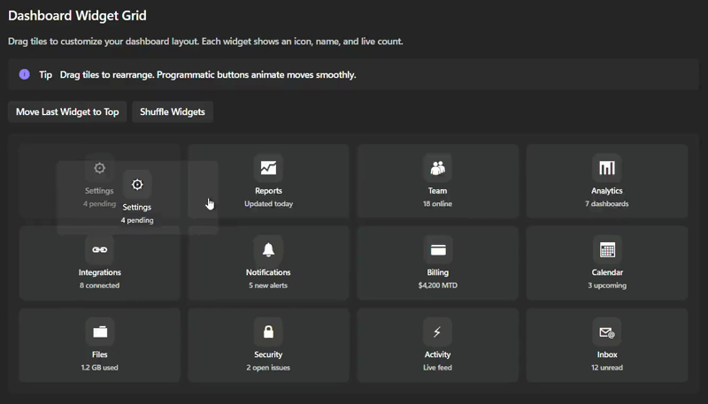
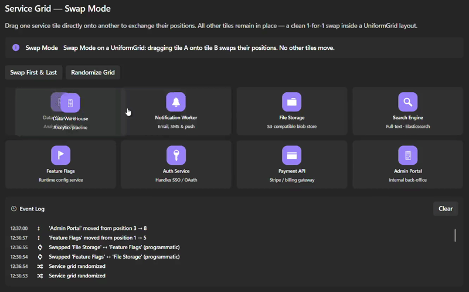

<p align="center">

</p>

<h2 align="center">Sortable.Avalonia - MVVM sort, swap, and cross-collection transfer for Avalonia</h2>

<p align="center">
    
    
    
    
    
</p>

MVVM-first attached-behavior library for Avalonia `ItemsControl` enabling drag-and-drop reordering, cross-collection transfers, reversible drop operations, drag handles, sort/swap modes, and animated programmatic updates.

> [!NOTE]
> #### Changes in Version 2.0.0
> - **Breaking change:** `AnimationDuration` now uses `TimeSpan` instead of `int` (milliseconds). Update your XAML and code to use TimeSpan format (e.g., `0:0:0.500`).
> - **New feature:** Release behavior with `ReleaseCommand` and `SortableReleaseEventArgs` for handling items released outside valid drop targets.

## Overview

- [Demo](#demo)
- [Features](#features)
- [Installation](#installation)
- [Quickstart](#quickstart)
- [Item Display Layout (ItemsPanelTemplate)](#item-display-layout-itemspaneltemplate)
- [Core Concepts](#core-concepts)
- [Properties Reference](#properties-reference)
- [Event Arguments](#event-arguments)
- [Mutation Helper Extensions](#mutation-helper-extensions)
- [Usage Patterns](#usage-patterns)
- [Transfer Modes](#transfer-modes)
- [Sortable Modes](#sortable-modes)
- [Drag Handles](#drag-handles)
- [Animation Control](#animation-control)
- [Custom Drag Template](#custom-drag-template)
- [Groups](#groups)
- [18 Demo Scenarios](#18-demo-scenarios)
- [Documentation](#documentation)
- [Contributing](#contributing)
- [License](#license)

## Demo

**Stack Panel (Horizontal Stack)**



**Kanban (Sort and Cross-collection drop)**



**Uniform Grid (Sort and Swap)**





## Features

| Capability | Description |
|---|---|
| **Same-collection sorting** | Reorder items within one list via `Sortable` property |
| **Cross-collection transfers** | Move/copy/swap items between lists via `Droppable` property |
| **Reversible drops** | Accept/reject drops in handler before commit |
| **Transfer modes** | `Move`, `Copy`, `Swap` |
| **Sortable modes** | `Sort` (shift), `Swap` (exchange) |
| **Drag handles** | Restrict drag start to marked controls |
| **Custom drag template** | Fully customize drag preview with `DraggingTemplate` |
| **Animation** | Smooth transitions for interactive + programmatic changes |
| **Groups** | Isolate interactions by group name |
| **Mouse + Touch** | Unified pointer input on all platforms |
| **Backward compatible** | Old `TransferCommand` still works |

## Installation

Install via NuGet (`Sortable.Avalonia`):

**.NET CLI**

```powershell
dotnet add package Sortable.Avalonia
```

**Package Manager Console**

```powershell
Install-Package Sortable.Avalonia
```

**XAML namespace:**

```xml
xmlns:sortable="clr-namespace:Sortable.Avalonia;assembly=Sortable.Avalonia"
```

## Quickstart

The control behavior is configured in XAML, while reorder/transfer decisions stay in your ViewModel via commands (`UpdateCommand`, `DropCommand`).

**1. Sortable list (same-collection only, ViewModel-driven updates):**

```xml
<ItemsControl sortable:Sortable.Sortable="True"
              sortable:Sortable.UpdateCommand="{Binding UpdateCmd}"
              ItemsSource="{Binding Items}">
    <ItemsControl.ItemTemplate>
        <DataTemplate>
            <Border sortable:Sortable.IsSortable="True" Cursor="Hand">
                <TextBlock Text="{Binding Name}" />
            </Border>
        </DataTemplate>
    </ItemsControl.ItemTemplate>
</ItemsControl>
```

```csharp
[RelayCommand]
void Update(SortableUpdateEventArgs e)
{
    if (!e.ApplyUpdateMutation())
    {
        return;
    }

    Console.WriteLine($"Moved from {e.OldIndex} to {e.NewIndex}");
}
```

**2. Droppable targets (cross-collection, ViewModel acceptance):**

```xml
<ItemsControl sortable:Sortable.Group="main"
              sortable:Sortable.Droppable="True"
              sortable:Sortable.DropCommand="{Binding DropCmd}"
              ItemsSource="{Binding TargetItems}">
    <ItemsControl.ItemTemplate>
        <DataTemplate>
            <Border sortable:Sortable.IsDroppable="True" />
        </DataTemplate>
    </ItemsControl.ItemTemplate>
</ItemsControl>
```

```csharp
[RelayCommand]
void Drop(SortableDropEventArgs e)
{
    e.IsAccepted = ValidateItem(e.Item);
    e.TransferMode = SortableTransferMode.Move;

    var applied = e.ApplyDropMutation();
    if (!applied)
    {
        Debug.WriteLine("Drop was rejected or produced no mutation.");
    }
}
```

**3. Run demo app:**

```powershell
dotnet run --project .\Sortable.Avalonia.Demo\Sortable.Avalonia.Demo.csproj
```

## Item Display Layout (ItemsPanelTemplate)

`Sortable` works with any `ItemsControl` panel. You can change how items are displayed by overriding `ItemsControl.ItemsPanel` with an `ItemsPanelTemplate`.

**Vertical stack (default list):**

```xml
<ItemsControl sortable:Sortable.Sortable="True"
              ItemsSource="{Binding Items}">
    <ItemsControl.ItemsPanel>
        <ItemsPanelTemplate>
            <StackPanel Orientation="Vertical" />
        </ItemsPanelTemplate>
    </ItemsControl.ItemsPanel>

    <ItemsControl.ItemTemplate>
        <DataTemplate>
            <Border sortable:Sortable.IsSortable="True" />
        </DataTemplate>
    </ItemsControl.ItemTemplate>
</ItemsControl>
```

**Horizontal stack (lane-style):**

```xml
<ItemsControl sortable:Sortable.Sortable="True"
              ItemsSource="{Binding Items}">
    <ItemsControl.ItemsPanel>
        <ItemsPanelTemplate>
            <StackPanel Orientation="Horizontal" />
        </ItemsPanelTemplate>
    </ItemsControl.ItemsPanel>
</ItemsControl>
```

**Uniform grid (card board):**

```xml
<ItemsControl sortable:Sortable.Sortable="True"
              ItemsSource="{Binding Cards}">
    <ItemsControl.ItemsPanel>
        <ItemsPanelTemplate>
            <UniformGrid Columns="3" />
        </ItemsPanelTemplate>
    </ItemsControl.ItemsPanel>
</ItemsControl>
```

**Wrap panel (responsive flow):**

```xml
<ItemsControl sortable:Sortable.Sortable="True"
              ItemsSource="{Binding Items}">
    <ItemsControl.ItemsPanel>
        <ItemsPanelTemplate>
            <WrapPanel Orientation="Horizontal" />
        </ItemsPanelTemplate>
    </ItemsControl.ItemsPanel>
</ItemsControl>
```

Tip: panel choice affects visual arrangement only; drag/drop behavior still depends on `Sortable`, `Droppable`, and item-level flags (`IsSortable`, `IsDroppable`), so layout stays in XAML while interaction rules stay in the ViewModel.

## Properties Reference

### ItemsControl Attached Properties

| Property | Type | Default | Description |
|---|---|:---:|---|
| `Sortable` | `bool` | `false` | Enable same-collection reordering |
| `Droppable` | `bool` | `false` | Enable cross-collection drop target |
| `Group` | `string?` | `null` | Group name (only same-group collections interact) |
| `UpdateCommand` | `ICommand?` | `null` | Fires on same-collection reorder |
| `DropCommand` | `ICommand?` | `null` | Fires on cross-collection drop (reversible) |
| `ReleaseCommand` | `ICommand?` | `null` | Fires when item is released outside any valid drop target |
| `TransferCommand` | `ICommand?` | `null` | Legacy cross-collection (auto-accept, deprecated) |
| `Mode` | `SortableMode` | `Sort` | In-collection behavior: `Sort` or `Swap` |
| `CrossCollectionTransferMode` | `SortableTransferMode` | `Move` | Default transfer mode: `Move`, `Copy`, or `Swap` |
| `AnimationDuration` | `TimeSpan` | `0:0:0.250` | Animation duration (as TimeSpan, e.g. `0:0:0.500` for 500ms) |

### Item Attached Properties

| Property | Type | Default | Description |
|---|---|:---:|---|
| `IsSortable` | `bool` | `false` | Item can be sorted within collection |
| `IsDroppable` | `bool` | `false` | Item can participate in drops |
| `IsDragHandle` | `bool` | `false` | Marks control as drag handle |

## Event Arguments

### SortableUpdateEventArgs

```csharp
public class SortableUpdateEventArgs
{
    public object? Item { get; set; }       // Item being moved
    public int OldIndex { get; set; }       // Original index
    public int NewIndex { get; set; }       // Target index
    public IList? SourceCollection { get; set; }
    public SortableMode Mode { get; set; }  // Sort or Swap
}
```

**Usage:**

```csharp
[RelayCommand]
void Update(SortableUpdateEventArgs e)
{
    if (e.ApplyUpdateMutation())
    {
        Debug.WriteLine($"{e.Item}: {e.OldIndex} → {e.NewIndex}");
    }
}
```

### SortableReleaseEventArgs

```csharp
public class SortableReleaseEventArgs
{
    public object? Item { get; set; }              // Item released
    public int OldIndex { get; set; }              // Original index
    public IList? SourceCollection { get; set; }   // Collection item was dragged from
}
```

**Usage:**

```csharp
[RelayCommand]
void Release(SortableReleaseEventArgs e)
{
    Debug.WriteLine($"Item '{e.Item}' released at index {e.OldIndex} from collection {e.SourceCollection}");
    // Custom logic for when an item is released outside any valid drop target
}
```

### SortableDropEventArgs

```csharp
public class SortableDropEventArgs
{
    // Read-only context
    public object? Item { get; set; }
    public IList? SourceCollection { get; set; }
    public IList? TargetCollection { get; set; }
    public int OldIndex { get; set; }
    public int NewIndex { get; set; }

    // Handler control
    public bool IsAccepted { get; set; } = true;                    // Accept/reject
    public SortableTransferMode TransferMode { get; set; } = Move;  // Move/Copy/Swap
    public object? ModifiedItem { get; set; }                       // Optional clone/modified item
    
    public object? GetItemToInsert() => ModifiedItem ?? Item;
}
```

**Usage:**

```csharp
[RelayCommand]
void Drop(SortableDropEventArgs e)
{
    e.IsAccepted = Validate(e.Item);
    e.TransferMode = SortableTransferMode.Move;

    if (!e.ApplyDropMutation())
    {
        Debug.WriteLine("Drop mutation was not applied.");
    }
}
```

### Mutation Helper Extensions

The library provides extension methods on event args so you can delegate mutation mechanics while keeping full control of business rules and acceptance logic.

**Three approaches:**

#### 1. Helper-driven (simplest)

```csharp
[RelayCommand]
void Drop(SortableDropEventArgs e)
{
    e.IsAccepted = true;
    e.TransferMode = SortableTransferMode.Move;
    
    if (!e.ApplyDropMutation())
    {
        Debug.WriteLine("Mutation failed or was rejected.");
    }
}
```

#### 2. Absolute control (manual mutations)

```csharp
[RelayCommand]
void Drop(SortableDropEventArgs e)
{
    if (e.Item is not TaskItem task || !ValidateBusinessRules(task))
    {
        e.IsAccepted = false;
        return;
    }

    e.IsAccepted = true;
    e.TransferMode = SortableTransferMode.Move;

    // Manually orchestrate the mutation with your exact logic
    e.TargetCollection.Insert(e.NewIndex, task);
    e.SourceCollection.RemoveAt(e.OldIndex);
    
    LogCustomTelemetry(task, e.SourceCollection, e.TargetCollection);
}
```

#### 3. Hybrid (recommended for most apps)

Validate domain rules yourself, delegate low-level list operations to the helper.

```csharp
[RelayCommand]
void Drop(SortableDropEventArgs e)
{
    if (e.Item is not KanbanCard card)
    {
        return;
    }

    var sourceColumn = FindColumn(e.SourceCollection);
    var targetColumn = FindColumn(e.TargetCollection);

    if (sourceColumn == null || targetColumn == null)
    {
        return;
    }

    // Domain rule: prevent duplicates
    if (targetColumn.Items.Contains(card))
    {
        e.IsAccepted = false;
        return;
    }

    e.IsAccepted = true;
    e.TransferMode = SortableTransferMode.Move;

    // Let helper handle the mutation
    if (!e.ApplyDropMutation())
    {
        return;
    }

    // Post-mutation side effects
    Console.WriteLine($"Moved '{card.Title}' from {sourceColumn.Name} to {targetColumn.Name}");
    NotifyTeam(card, targetColumn);
}
```

**Return values:**
- `e.ApplyUpdateMutation()` → `bool` (true if mutation applied)
- `e.ApplyDropMutation()` → `bool` (true if mutation applied)

Use the return value to gate logging, telemetry, or conditional side effects.

### SortableTransferEventArgs (Deprecated)

```csharp
public class SortableTransferEventArgs
{
    public object? Item { get; set; }
    public IList? SourceCollection { get; set; }
    public IList? TargetCollection { get; set; }
    public int OldIndex { get; set; }
    public int NewIndex { get; set; }
}
```

Use `DropCommand` with `SortableDropEventArgs` instead.

## Usage Patterns

For panel/layout examples (`StackPanel`, `UniformGrid`, `WrapPanel`), see [Item Display Layout (ItemsPanelTemplate)](#item-display-layout-itemspaneltemplate).

### Pattern 1: Sortable-only list

```xml
<ItemsControl sortable:Sortable.Sortable="True"
              sortable:Sortable.UpdateCommand="{Binding UpdateCmd}"
              ItemsSource="{Binding Items}">
    <ItemsControl.ItemTemplate>
        <DataTemplate>
            <Border sortable:Sortable.IsSortable="True" Cursor="Hand">
                <TextBlock Text="{Binding}" />
            </Border>
        </DataTemplate>
    </ItemsControl.ItemTemplate>
</ItemsControl>
```

**Result:** Reorder within list ✓, transfer between lists ✗

### Pattern 2: Droppable-only zones

```xml
<ItemsControl sortable:Sortable.Group="zone"
              sortable:Sortable.Droppable="True"
              sortable:Sortable.DropCommand="{Binding DropCmd}"
              ItemsSource="{Binding Items}">
    <ItemsControl.ItemTemplate>
        <DataTemplate>
            <Border sortable:Sortable.IsDroppable="True" />
        </DataTemplate>
    </ItemsControl.ItemTemplate>
</ItemsControl>
```

**Result:** Transfer between zones ✓, reorder within zone ✗

### Pattern 3: Full dual-mode

```xml
<ItemsControl sortable:Sortable.Sortable="True"
              sortable:Sortable.Droppable="True"
              sortable:Sortable.Group="shared"
              sortable:Sortable.UpdateCommand="{Binding UpdateCmd}"
              sortable:Sortable.DropCommand="{Binding DropCmd}"
              ItemsSource="{Binding Items}">
    <ItemsControl.ItemTemplate>
        <DataTemplate>
            <Border sortable:Sortable.IsSortable="True"
                    sortable:Sortable.IsDroppable="True" />
        </DataTemplate>
    </ItemsControl.ItemTemplate>
</ItemsControl>
```

**Result:** Reorder within list ✓, transfer between lists ✓

### Pattern 4: Conditional acceptance

```csharp
[RelayCommand]
void Drop(SortableDropEventArgs e)
{
    if (e.Item is TaskItem task)
    {
        // Business rule validation
        e.IsAccepted = task.Priority == Priority.Urgent
                       && !TargetContains(task)
                       && UserHasPermission();
        e.TransferMode = SortableTransferMode.Move;
        _ = e.ApplyDropMutation();
    }
}
```

### Pattern 5: Copy mode (duplicate on transfer)

```csharp
[RelayCommand]
void Drop(SortableDropEventArgs e)
{
    if (e.Item is TemplateItem original)
    {
        e.ModifiedItem = new TemplateItem(original) { Id = Guid.NewGuid() };
        e.TransferMode = SortableTransferMode.Copy;
        e.IsAccepted = true;
        _ = e.ApplyDropMutation();
    }
}
```

### Pattern 6: Prevent duplicates

```csharp
[RelayCommand]
void Drop(SortableDropEventArgs e)
{
    var target = e.TargetCollection as ObservableCollection<MyItem>;
    var item = e.Item as MyItem;

    e.IsAccepted = target?.Any(x => x.Id == item?.Id) != true;
    e.TransferMode = SortableTransferMode.Move;
    _ = e.ApplyDropMutation();
}
```

### Pattern 7: Cross-collection swap

```xml
<ItemsControl sortable:Sortable.Group="rotation"
              sortable:Sortable.Droppable="True"
              sortable:Sortable.CrossCollectionTransferMode="Swap"
              sortable:Sortable.DropCommand="{Binding DropCmd}"
              ItemsSource="{Binding TeamA}" />

<ItemsControl sortable:Sortable.Group="rotation"
              sortable:Sortable.Droppable="True"
              sortable:Sortable.CrossCollectionTransferMode="Swap"
              sortable:Sortable.DropCommand="{Binding DropCmd}"
              ItemsSource="{Binding TeamB}" />
```

```csharp
[RelayCommand]
void Drop(SortableDropEventArgs e)
{
    e.TransferMode = SortableTransferMode.Swap;  // Exchange items
    e.IsAccepted = true;
    _ = e.ApplyDropMutation();
}
```

### Pattern 8: Drag handles

```xml
<ItemsControl sortable:Sortable.Sortable="True" ItemsSource="{Binding Items}">
    <ItemsControl.ItemTemplate>
        <DataTemplate>
            <Border sortable:Sortable.IsSortable="True">
                <Grid ColumnDefinitions="Auto,*,Auto">
                    <!-- Drag handle -->
                    <PathIcon Grid.Column="0"
                              sortable:Sortable.IsDragHandle="True"
                              Data="M8 2v20M16 2v20"
                              Cursor="Hand" />
                    <!-- Interactive content -->
                    <TextBlock Grid.Column="1" Text="{Binding Name}" />
                    <Button Grid.Column="2" Content="Edit" />
                </Grid>
            </Border>
        </DataTemplate>
    </ItemsControl.ItemTemplate>
</ItemsControl>
```

**Result:** Only drag via handle icon. Text and button remain clickable.

### Pattern 9: Same-collection swap mode

```xml
<ItemsControl sortable:Sortable.Sortable="True"
              sortable:Sortable.Mode="Swap"
              sortable:Sortable.UpdateCommand="{Binding UpdateCmd}"
              ItemsSource="{Binding Items}">
    <ItemsControl.ItemTemplate>
        <DataTemplate>
            <Border sortable:Sortable.IsSortable="True" />
        </DataTemplate>
    </ItemsControl.ItemTemplate>
</ItemsControl>
```

**Result:** Items swap positions instead of shifting.

### Pattern 10: Custom animation speed

```xml
<ItemsControl sortable:Sortable.Sortable="True"
              sortable:Sortable.AnimationDuration="0:0:0.500"
              ItemsSource="{Binding Items}">
    <!-- Slower 500ms animations -->
</ItemsControl>

<ItemsControl sortable:Sortable.Sortable="True"
              sortable:Sortable.AnimationDuration="0:0:0.100"
              ItemsSource="{Binding Items}">
    <!-- Faster 100ms animations -->
</ItemsControl>
```

### Pattern 11: Custom drag template

You can fully customize the drag preview for any ItemsControl using the `DraggingTemplate` attached property. This lets you define a `DataTemplate` for the drag visual, supporting rich layouts, icons, and dynamic content.

```xml
<UserControl.Resources>
    <DataTemplate x:Key="CustomDragTemplate" x:DataType="models:SortableItem">
        <Border Padding="10" Background="{DynamicResource CardBackgroundFillColorDefaultBrush}" BorderBrush="{DynamicResource AccentFillColorDefaultBrush}" BorderThickness="2" CornerRadius="10" Effect="{DynamicResource ShadowEffect}" Opacity="0.98">
            <Grid ColumnDefinitions="32,*,Auto" ColumnSpacing="12">
                <TextBlock Grid.Column="0" VerticalAlignment="Center" FontSize="28" Text="{Binding Tag}" />
                <StackPanel Grid.Column="1" Spacing="2">
                    <TextBlock FontSize="18" FontWeight="Bold" Text="{Binding Name}" />
                    <TextBlock FontSize="13" Foreground="{DynamicResource TextFillColorSecondaryBrush}" Text="{Binding Note}" />
                </StackPanel>
                <Border Grid.Column="2" Padding="6,2" VerticalAlignment="Center" Background="{DynamicResource AccentFillColorDefaultBrush}" CornerRadius="6">
                    <TextBlock FontSize="13" FontWeight="SemiBold" Foreground="White" Text="{Binding Tag}" />
                </Border>
            </Grid>
        </Border>
    </DataTemplate>
</UserControl.Resources>
<ItemsControl
    sortable:Sortable.DraggingTemplate="{StaticResource CustomDragTemplate}"
    sortable:Sortable.Sortable="True"
    ItemsSource="{Binding Intake}">
    <!-- ...item template... -->
</ItemsControl>
```

**Result:** Custom drag preview for each item, supporting rich layouts and dynamic content.

**Property Reference:** `DraggingTemplate` (attached property)

**Demo:** See "Custom Drag Template" scenario in the demo app.

## Transfer Modes

| Mode | Behavior | Source | Target | Example Use Case |
|---|---|:---:|:---:|---|
| `Move` | Remove from source, add to target | Item removed | Item added | Task workflow, file organization |
| `Copy` | Keep in source, add to target | Item stays | Copy added | Template duplication, reference sharing |
| `Swap` | Exchange items | Gets target item | Gets source item | Role rotation, seat assignment |

**Set via:**

```csharp
e.TransferMode = SortableTransferMode.Move;    // or .Copy or .Swap
```

**Or set default for preview animations:**

```xml
sortable:Sortable.CrossCollectionTransferMode="Swap"
```

## Sortable Modes

| Mode | Behavior | Use Case |
|---|---|---|
| `Sort` | Shift items, insert at drop position | Priority queues, task ordering |
| `Swap` | Exchange positions with drop target | Role swaps, seat assignments |

**Set via:**

```xml
sortable:Sortable.Mode="Sort"    <!-- Default -->
sortable:Sortable.Mode="Swap"
```

## Drag Handles

Restrict drag start to specific controls:

```xml
<ItemsControl sortable:Sortable.Sortable="True" ItemsSource="{Binding Items}">
    <ItemsControl.ItemTemplate>
        <DataTemplate>
            <Border sortable:Sortable.IsSortable="True">
                <Grid ColumnDefinitions="Auto,*">
                    <PathIcon sortable:Sortable.IsDragHandle="True"
                              Data="M8 2v20M16 2v20"
                              Cursor="Hand" />
                    <TextBlock Grid.Column="1" Text="{Binding}" />
                </Grid>
            </Border>
        </DataTemplate>
    </ItemsControl.ItemTemplate>
</ItemsControl>
```

**Behavior:** Drag only starts from `IsDragHandle="True"` controls. Text, buttons, etc. remain clickable.

## Animation Control

**Set duration (TimeSpan):**

```xml
sortable:Sortable.AnimationDuration="0:0:0.500"    <!-- Default: 0:0:0.250 -->
```

**Applies to:**
- Interactive drag previews (items shifting during drag)
- Programmatic collection changes
- Cross-collection travel animations

## Groups

**Isolate interactions:**

```xml
<!-- HR group -->
<ItemsControl sortable:Sortable.Group="hr" sortable:Sortable.Droppable="True" />
<ItemsControl sortable:Sortable.Group="hr" sortable:Sortable.Droppable="True" />

<!-- Engineering group (separate) -->
<ItemsControl sortable:Sortable.Group="eng" sortable:Sortable.Droppable="True" />
```

**Rule:** Items only transfer between collections with matching `Group` values.

## 18 Demo Scenarios

Run the app to explore each demo in a dedicated tab:

| # | Demo | Description |
|:---:|---|---|
| 1 | **Kanban Board** | Task cards moving through triage → engineering → release columns |
| 2 | **Vertical List** | Simple sortable task list with reordering |
| 3 | **Drag Handle** | Items with icon handles, leaving text/buttons clickable |
| 4 | **Grid Layout** | Card-based layout with drag-and-drop in grid arrangement |
| 5 | **Horizontal Stack** | Horizontal lane with left-to-right item ordering |
| 6 | **Multiple Groups** | Separate HR and Engineering groups (isolated interactions) |
| 7 | **Disabled Items** | Some items locked (non-draggable) via conditional `IsSortable` |
| 8 | **Sortable Only** | Lists allow reordering but reject cross-list transfers |
| 9 | **Droppable Only** | Drop zones accept items but prevent internal reordering |
| 10 | **Cross Drag (Instant)** | Instant cross-collection transfers (no animation delay) |
| 11 | **Cross Programmatic Animation** | Programmatic `ObservableCollection` changes with smooth travel animation |
| 12 | **UniformGrid Interaction** | Interactive drag in `UniformGrid` panel |
| 13 | **UniformGrid Programmatic** | Programmatic changes in `UniformGrid` with animation |
| 14 | **Copy Mode** | Template items duplicated (not moved) on transfer |
| 15 | **Conditional Acceptance** | Drop validation rules (e.g., only URGENT tasks accepted) |
| 16 | **Sort Mode** | Default shift-based reordering within same list |
| 17 | **Swap Mode** | Exchange positions (no shifting) within same list |
| 18 | **Cross Swap** | Exchange items between two collections in one gesture |

**Run:**

```powershell
dotnet run --project .\Sortable.Avalonia.Demo\Sortable.Avalonia.Demo.csproj
```

## Core Concepts

### MVVM-First Workflow

- **View (XAML):** Declare `Sortable` attached properties, `ItemsSource`, and command bindings.
- **ViewModel:** Validate rules, choose transfer/sort behavior, and apply mutations via event-arg helpers.
- **Model:** Remains plain data; no drag/drop UI logic required.

### Sortable vs Droppable

| Property | Purpose | Drag Within List | Drag Between Lists |
|---|---|:---:|:---:|
| `Sortable="True"` | Enable reordering | ✓ | ✗ |
| `Droppable="True"` | Enable drop target | ✗ | ✓ |
| Both `="True"` | Enable both | ✓ | ✓ |

### Item-Level Control

| Scenario | IsSortable | IsDroppable |
|---|:---:|:---:|
| Can reorder and transfer | ✓ | ✓ |
| Can reorder only | ✓ | ✗ |
| Can transfer only | ✗ | ✓ |
| Locked (no drag) | ✗ | ✗ |

### Commands

 | Command | Fires When | Event Args | Purpose |
 |---|---|---|---|
| `UpdateCommand` | Same-collection reorder | `SortableUpdateEventArgs` | ViewModel handles reorder rules and mutation |
| `DropCommand` | Cross-collection drop | `SortableDropEventArgs` | ViewModel accepts/rejects and selects transfer mode |
| `ReleaseCommand` | Release outside drop target | `SortableReleaseEventArgs` | ViewModel handles item release outside valid drop zone |
| `TransferCommand` | Cross-collection transfer | `SortableTransferEventArgs` | Legacy fallback (auto-accept), prefer `DropCommand` |

## Contributing

Contributions are welcome.

- Open an issue for bug reports or feature proposals.
- Share repro steps and expected behavior for drag/drop issues.
- Keep PRs focused and include before/after behavior notes.

## License

This project is licensed under the MIT License. See `LICENSE` for details.
